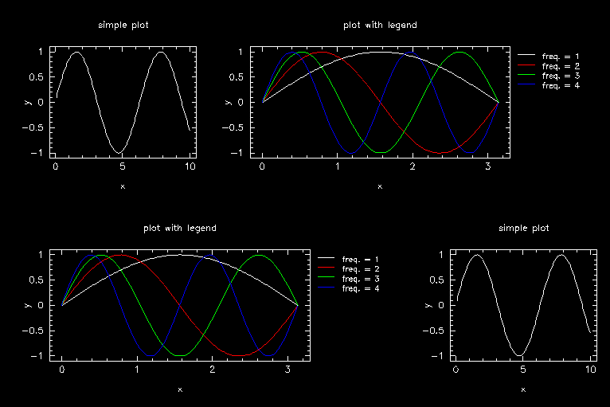
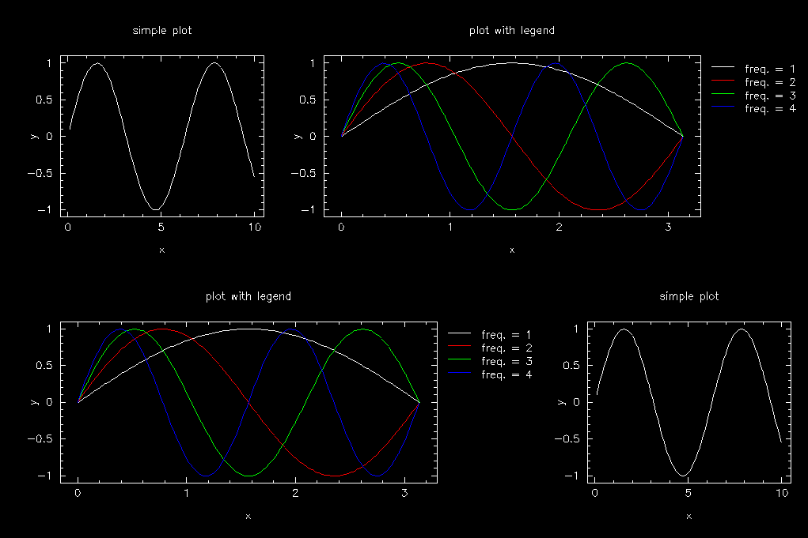
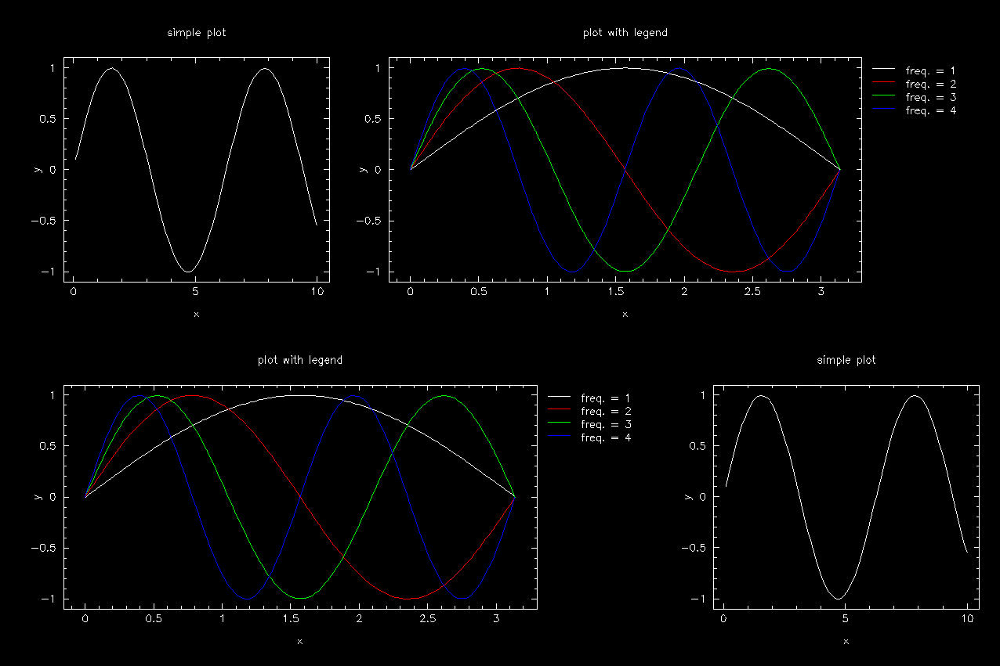
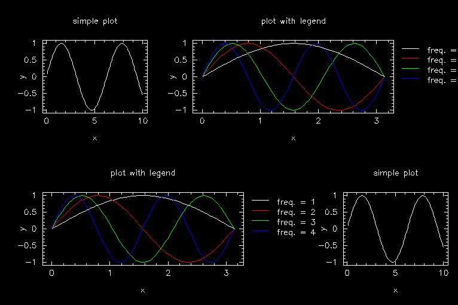
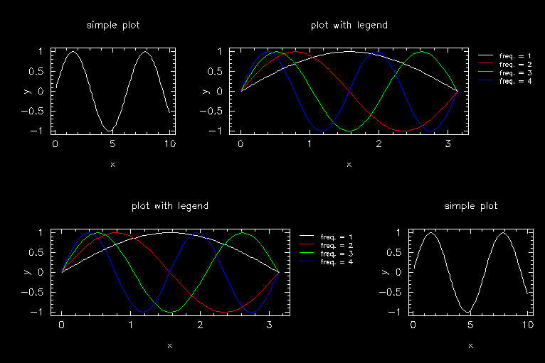
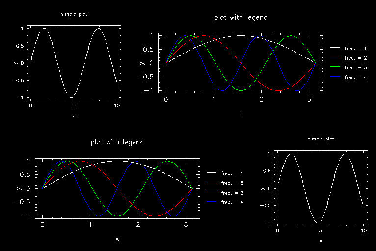

# Grid plots with PGPLOT

## Layout

Let's start with a simple grid.  We'll make it 3 columns by 2 rows.  The file width we'll set to 12 (which is about 1152 pixels on my MacBook Pro), and we'll set the aspect ratio (height/width) to 2/3, so that the cells of our grid will be square.

    file_width = 12.0
    file_aspect_ratio = 0.6666667

    grid_num_cols = 3
    grid_num_rows = 2
    grid_num_plots = 6

We want some padding between the rows; let's set that to 20 px.

    grid_col_offset_in_px = 20.0
    grid_row_offset_in_px = 20.0

Finally, let's put a border around our grid and set it to be 0.02 of the total window extent.

    grid_pad_left = 0.02
    grid_pad_right = 0.02
    grid_pad_top = 0.02
    grid_pad_bottom = 0.02

Now we'll box each grid, using our 'Box' plot

    grid_plot_names(1) = 'Box'
    grid_plot_col(1) = 1
    grid_plot_row(1) = 1
    grid_plot_colspan(1) = 1
    grid_plot_rowspan(1) = 1

and so forth for the other plots. Here is how it looks.

Let's reduce the number of plots: we'll make the upper right and lower left plots span 2 columns:

    grid_num_plots = 4
    grid_plot_names(1) = 'Box'
    grid_plot_col(1) = 1
    grid_plot_row(1) = 1
    grid_plot_colspan(1) = 1
    grid_plot_rowspan(1) = 1
    
    grid_plot_names(2) = 'Box'
    grid_plot_col(2) = 2
    grid_plot_row(2) = 1
    grid_plot_colspan(2) = 2
    grid_plot_rowspan(2) = 1
    
    grid_plot_names(3) = 'Box'
    grid_plot_col(3) = 1
    grid_plot_row(3) = 2
    grid_plot_colspan(3) = 2
    grid_plot_rowspan(3) = 1
    
    grid_plot_names(4) = 'Box'
    grid_plot_col(4) = 3
    grid_plot_row(4) = 2
    grid_plot_colspan(4) = 1
    grid_plot_rowspan(4) = 1

Here are the results:

Of course, we need to allow space for the axes and plot titles.  We specify their lengths in units of the character size. Let's specify a target character size of 1 em = 14 px, and make the left, top, and bottom margins 4 em = 56 px:

    simplt_pad_left_in_em = 4.0
    simplt_pad_right_in_em = 0.0
    simplt_pad_top_in_em = 4.0
    simplt_pad_bottom_in_em = 4.0
    simplt_char_size_in_px = 14.0

(I am using the `simplt` flags for the boxes as well)

Note that this spacing is fixed even as we reduce the plot size:

    file_width = 9.0

Let's go back to our original size and make the upper right and lower left plots have room for a legend that takes up 0.18 of the plot width:

    grid_plot_names(2) = 'Box_with_Legend'
    grid_plot_names(3) = 'Box_with_Legend'
    lgdplt_legend_width = 0.18
    lgdplt_legend_left_margin_in_em = 1.0

We also specifed a gap of 1.0 em between the right edge of the plot and the legend.

## Adding plots

Now we are ready to add real plots. We have two: 'Simple_Plot', which just draws a sine wave, and 'Legend_Plot', which draws a sine wave and a few harmonics and makes a legend.  

    grid_plot_names(1) = 'Legend_Plot'
    grid_plot_names(2) = 'Simple_Plot'
    grid_plot_names(3) = 'Legend_Plot'
    grid_plot_names(4) = 'Simple_Plot'

We put a maring of 0.5 em at the top, and set the distance between baselines in the legend to be 1.2 em; we specify the length of the lines in the legend to be 2.0em:

    lgdplt_legend_top_margin_in_em = 0.5
    lgdplt_legend_lineskip_in_em = 1.2
    lgdplt_legend_line_length_in_em = 2.0 

This gives the following plot.

Notice that the text retains its size as we scale up

    file_width = 15.0
    

and down

    file_width = 9.0
    

Of course, our legend is now too big. Let's reduce that to 70% of the current text size

    lgdplt_legend_txt_scale = 0.7

This also reduces the line lengths, since they are in units of text size.

Let's push the legend down and increase the spacing between lines

    lgdplt_legend_top_margin_in_em = 2.5
    lgdplt_legend_lineskip_in_em = 2.0

Finally, let's set the target character size on the simple plots (upper left and lower right) to be 10px:

    simplt_char_size_in_px = 10.0

