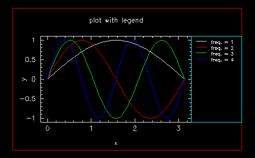
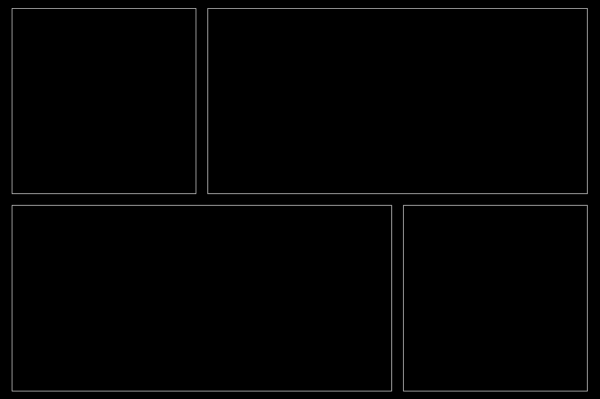
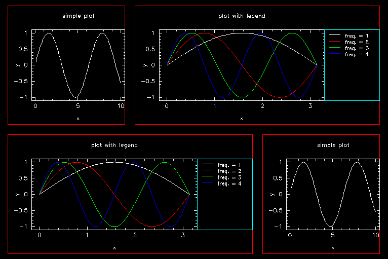

# Plotting

## Layout of a single plot

We begin with a single plot.  When we call `PGPLOT` we specify a device width and aspect ratio (height/width).  The width roughly corresponds to a size in inches. For this example, we'll use a landscape golden rectangle aspect ratio.

    win_width = 6.0
    win_aspect_ratio = 0.618

Next, we specify a _margin_ around our plot.  This is in fractional units, i.e., setting `plotname_left_margin = 0.05` means that the left margin of `plotname` is 5% of the plot area width. Our plot area in this case is the whole window, but if our plot were part of a grid layout it would be just the area assigned to it.  Setting

    simplt_left_margin = 0.05
    simplt_right_margin = 0.05
    simplt_top_margin = 0.05
    simplt_bottom_margin = 0.05

gives us the "box" shown below.

Now we need to put something in our box. Our plot will have a title and labels on the left vertical and lower horizontal axes, and we need to allow padding for this.  We specify this padding in units of the character size. Let's specify a target character size of 1 em = 14 px, and make the left, top, and bottom margins 4 em = 56 px:

    simplt_pad_left_in_em = 4.0
    simplt_pad_right_in_em = 0.0
    simplt_pad_top_in_em = 4.0
    simplt_pad_bottom_in_em = 4.0
    simplt_char_size_in_px = 14.0

This gives us the following plot; we've kept a box showing the margins.

A character size of 14 px is common for web browsers.  If you output to a postscript file, `PGPLOT` uses a resolution of 1000 px/inch: a 10 pt character size corresponds to 138 px.

To add a legend, we need to specify the left and top edge, relative to the plot frame.

    lgdplt_legend_left_edge = 0.75
    lgdplt_legend_top_edge = 1.0

This puts the left edge of the legend a distance of 0.75 plot width from the left-hand frame, and aligns the top of the legend with the top frame of the plot.  If we want the legend outside the plot frame, we need to move the right edge of the plot inward,

    lgdplt_plot_right_edge = 0.75

This give the following layout, with the space for the legend marked in red.

Now we'll put in our figure.  To control the look of the legend, we specify the margin between the left edge of the legend "box" and the lines, the margin between the top and the legend text, the space between lines, and the length of the line.  All of these are in units of em.

    lgdplt_legend_left_margin_in_em = 1.0
    lgdplt_legend_top_margin_in_em = 0.5
    lgdplt_legend_lineskip_in_em = 1.2
    lgdplt_legend_line_length_in_em = 2.0

We also make the text of the legend 70% of the size in the plot.

    lgdplt_legend_txt_scale = 0.7

This give the following plot.

## Layout of a grid.

Now that we have the mechanics of a single plot, we'll assemble several of them into a grid. Our trial grid is 3 columns by 2 rows.  The width we'll set to 12 (which is about 1152 pixels on my MacBook Pro), and we'll set the aspect ratio (height/width) to 2/3, so that the cells of our grid will be square.

    file_width = 12.0
    file_aspect_ratio = 0.6666667

    grid_num_cols = 3
    grid_num_rows = 2
    grid_num_plots = 6

We can add an offset between the rows and columns; let's set that to 20 px.

    grid_col_offset_in_px = 20.0
    grid_row_offset_in_px = 20.0

Finally, let's put a margin of 0.02 of the viewing area width and height around our grid.

    grid_pad_left = 0.02
    grid_pad_right = 0.02
    grid_pad_top = 0.02
    grid_pad_bottom = 0.02

Now we'll box each grid, using our 'Box' plot

    grid_plot_names(1) = 'Box'
    grid_plot_col(1) = 1
    grid_plot_row(1) = 1
    grid_plot_colspan(1) = 1
    grid_plot_rowspan(1) = 1

and so forth for the other plots.
Here is how it looks.

Let's reduce the number of plots: we'll make the upper right and lower left plots span 2 columns:

    grid_num_plots = 4
    grid_plot_names(1) = 'Box'
    grid_plot_col(1) = 1
    grid_plot_row(1) = 1
    grid_plot_colspan(1) = 1
    grid_plot_rowspan(1) = 1
    
    grid_plot_names(2) = 'Box'
    grid_plot_col(2) = 2
    grid_plot_row(2) = 1
    grid_plot_colspan(2) = 2
    grid_plot_rowspan(2) = 1
    
    grid_plot_names(3) = 'Box'
    grid_plot_col(3) = 1
    grid_plot_row(3) = 2
    grid_plot_colspan(3) = 2
    grid_plot_rowspan(3) = 1
    
    grid_plot_names(4) = 'Box'
    grid_plot_col(4) = 3
    grid_plot_row(4) = 2
    grid_plot_colspan(4) = 1
    grid_plot_rowspan(4) = 1

This produces the following plot.

Now we can add our plots.  Since the plot with a legend have a larger horizontal extent, we'll put those in the boxes spanning two columns and tha smaller plots in the single column boxes.

    grid_plot_names(1) = 'Simple_Plot'
    grid_plot_col(1) = 1
    grid_plot_row(1) = 1
    grid_plot_colspan(1) = 1
    grid_plot_rowspan(1) = 1
    
    grid_plot_names(2) = 'Legend_Plot'
    grid_plot_col(2) = 2
    grid_plot_row(2) = 1
    grid_plot_colspan(2) = 2
    grid_plot_rowspan(2) = 1
    
    grid_plot_names(3) = 'Legend_Plot'
    grid_plot_col(3) = 1
    grid_plot_row(3) = 2
    grid_plot_colspan(3) = 2
    grid_plot_rowspan(3) = 1
    
    grid_plot_names(4) = 'Simple_Plot'
    grid_plot_col(4) = 3
    grid_plot_row(4) = 2
    grid_plot_colspan(4) = 1
    grid_plot_rowspan(4) = 1

We also apply a reduction in scale to the text of each plot, and a further reduction for the legend plot:

    grid_subplot_text_scale = 0.85
    lgdplt_legend_txt_scale = 0.85

Since the default character size of the plots are at 14 px, this means when shown on a grid the text will be at 11 px and the legends will be at 10 px.

Now let's reduce the size of the figure:

    file_width = 9.0

We'll keep everything else the same, with one exception. We'll need to allow more space for the figure legend:

    lgdplt_plot_right_edge = 0.75
    lgdplt_legend_left_edge = 0.75

This produces the following plot; notice that the text is at the same scale as the previous version.

Here is the final result, with the layout boxes removed.

